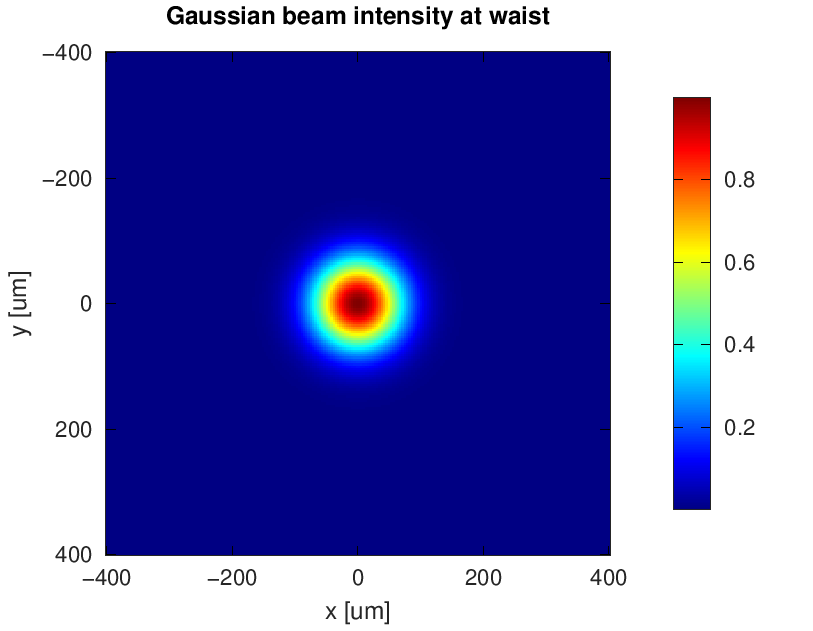
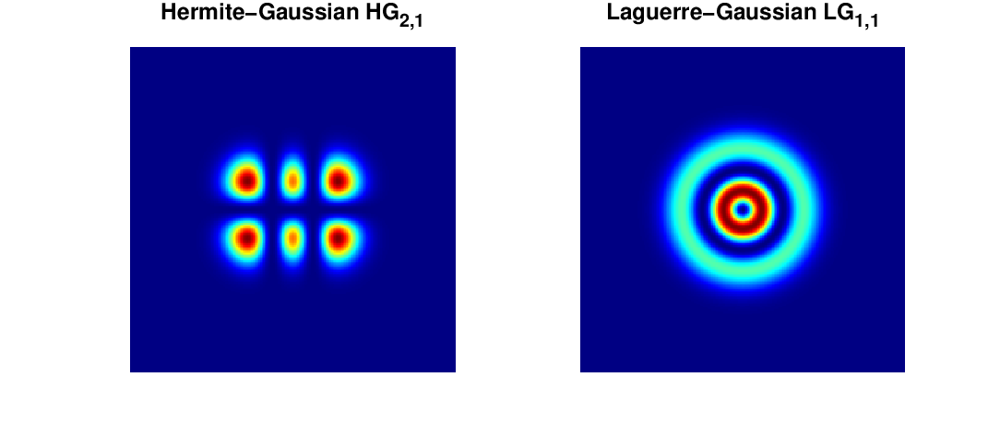
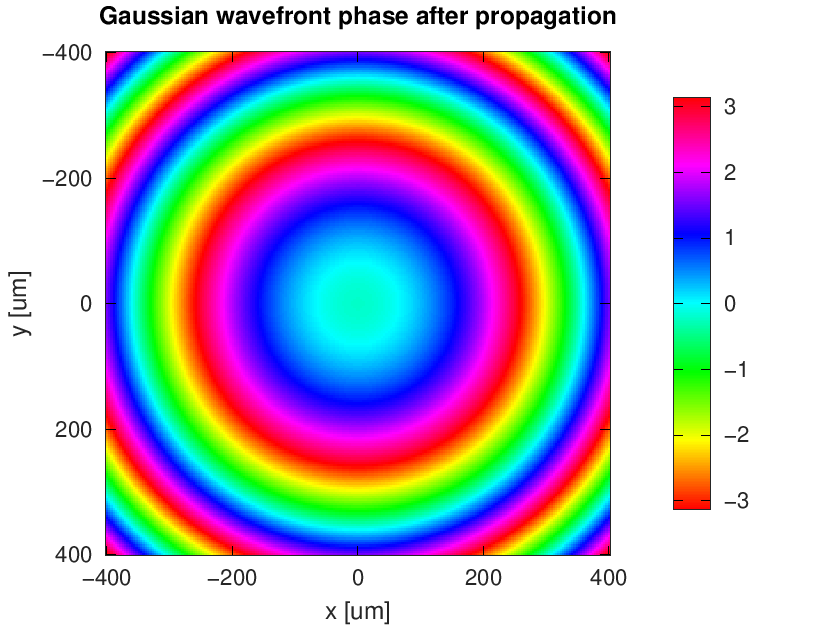

# ParaxialOptics

Paraxial beam propagation and wavefront analysis in GNU Octave and MATLAB.

**Author:** Ugalde-Ontiveros J.A.

[](https://github.com/dreamjorge/ParaxialOptics/actions/workflows/octave.yml)
[](https://github.com/dreamjorge/ParaxialOptics/actions/workflows/matlab.yml)

Documentation: https://dreamjorge.github.io/ParaxialOptics/

## Project Status

**v1.0.1** — Current release. `+paraxial/` is the canonical namespace.

The release packages are built from an explicit allowlist. Internal planning files, agent/runtime metadata, and historical process artifacts are not included in user-facing MATLAB/Octave packages.

`src/` is deprecated and only kept for backward compatibility during the Strangler Fig migration. Use `BeamFactory.create()` or direct `+paraxial/` classes.

Legacy adapters and research helpers remain available for compatibility and reproducibility. New work should target `+paraxial/` and `BeamFactory.create()`.

GitHub Actions is the canonical CI system for this repository. The active workflows are:

Active workflows:
- `.github/workflows/octave.yml` — Octave portable tests.
- `.github/workflows/matlab.yml` — MATLAB portable tests when a MATLAB license is available.
- `.github/workflows/release.yml` — Octave package generation on `v*` tags; MATLAB toolbox generation is optional and requires enabling `ENABLE_MATLAB_RELEASE` with a valid MATLAB license.

## Project Structure

```
ParaxialOptics/
├── +paraxial/                  # Canonical package namespace
│   ├── +beams/                 # Beam classes
│   ├── +parameters/            # Parameter classes
│   ├── +computation/           # Formula/logic layer
│   ├── +propagation/           # Field and ray propagation
│   └── +visualization/         # Visualization utilities
├── ParaxialBeams/              # Utilities (BeamFactory, GridUtils, etc.)
├── examples/
│   ├── canonical/              # Recommended examples for new users
│   └── legacy/                 # Archived research scripts
├── tests/
│   ├── portable_runner.m       # Canonical test runner (CI uses this)
│   ├── modern/                 # Test suite for +paraxial/ classes
│   └── edge_cases/             # Edge case and regression tests
├── src/                        # Deprecated transition adapters
├── docs/
│   ├── index.md                # GitHub Pages documentation home
│   ├── getting-started.md      # Installation and first propagation workflow
│   ├── examples.md             # Canonical example guide
│   ├── api.md                  # Public API overview
│   ├── ARCHITECTURE.md         # Architecture documentation
│   ├── COMPATIBILITY_REDUCTION.md
│   ├── ADDONS_INVENTORY.md
│   ├── ADDONS_CLEANUP_READINESS.md
│   └── ROADMAP.md              # Active roadmap
├── setpaths.m                  # Path initialization
├── CHANGELOG.md
└── DESCRIPTION                 # Package metadata
```

## Quick Start

### Install Package

**Octave:**
```matlab
pkg install 'https://github.com/dreamjorge/ParaxialOptics/releases/latest/download/paraxial_optics-1.0.1.tar.gz'
pkg load paraxial_optics
```

**MATLAB:** When an `.mltbx` artifact is available in [releases](https://github.com/dreamjorge/ParaxialOptics/releases), double-click it to install. Without a MATLAB CI license, use the manual setup below.

### Manual Setup

```matlab
% Option 1: setpaths() utility
setpaths

% Option 2: Add paths directly
addpath('+paraxial/+beams', '+paraxial/+parameters', '+paraxial/+computation');
addpath('ParaxialBeams');
```

### Create and Propagate Beam

```matlab
% Via BeamFactory (preferred)
beam = BeamFactory.create('gaussian', 100e-6, 632.8e-9);

% Create grid
grid = GridUtils(1024, 1024, 1e-3, 1e-3);
[X, Y] = grid.create2DGrid();

% Field at waist
field = beam.opticalField(X, Y, 0);

% Propagate via FFT
prop = FFTPropagator(grid, 632.8e-9);
field_z = prop.propagate(beam, 0.1);
```

## Visual Examples

These figures are generated with `tools/generate_readme_figures.m`, so the README visuals stay tied to executable optics code.

| Gaussian intensity | Hermite/Laguerre modes | Wavefront phase |
|---|---|---|
|  |  |  |

## Supported Beam Types

| Type | Class | Parameters |
|------|-------|------------|
| Gaussian | `GaussianBeam` | w0, λ |
| Hermite | `HermiteBeam` | w0, λ, n, m |
| Laguerre | `LaguerreBeam` | w0, λ, l, p |
| Elegant Hermite | `ElegantHermiteBeam` | w0, λ, n, m |
| Elegant Laguerre | `ElegantLaguerreBeam` | w0, λ, l, p |
| Hankel | `HankelLaguerre` | w0, λ, l, p, type |
| Hankel Hermite | `HankelHermite` | w0, λ, n, m, type |

## Beam API Contract

Every beam implements:

```matlab
field = beam.opticalField(X, Y, z)    % [Ny x Nx] complex
params = beam.getParameters(z)       % BeamParameters at z
name = beam.beamName()               % 'gaussian', 'hermite_2_1', etc.
```

## Propagation Methods

```matlab
% FFT (angular spectrum)
prop = FFTPropagator(grid, lambda);
field = prop.propagate(beam, z);

% Analytic (direct formula)
prop = AnalyticPropagator(grid);
field = prop.propagate(beam, z);

% Ray tracing
prop = RayTracePropagator(grid, 'RK4', 1e-3);
bundle = prop.propagate(beam, z);
```

## Utilities

```matlab
% Physical constants
k = PhysicalConstants.waveNumber(lambda);
zr = PhysicalConstants.rayleighDistance(w0, lambda);

% Grid creation
grid = GridUtils(Nx, Ny, Dx, Dy);
[X, Y] = grid.create2DGrid();
[Kx, Ky] = grid.createFreqGrid();

## Beam API Contract

Every beam implements:

```matlab
field = beam.opticalField(X, Y, z)    % [Ny x Nx] complex
params = beam.getParameters(z)       % BeamParameters at z
name = beam.beamName()               % 'gaussian', 'hermite_2_1', etc.
```

## Propagation Methods

Three interchangeable propagation methods:

```matlab
% FFT (angular spectrum)
prop = FFTPropagator(grid, lambda);
field = prop.propagate(beam, z);

% Analytic (direct formula)
prop = AnalyticPropagator(grid);
field = prop.propagate(beam, z);

% Ray tracing
prop = RayTracePropagator(grid, 'RK4', 1e-3);
bundle = prop.propagate(beam, z);
```

## Factory Pattern — BeamFactory

```matlab
% All beams via Factory
g  = BeamFactory.create('gaussian', 100e-6, 632.8e-9);
hg = BeamFactory.create('hermite', 100e-6, 632.8e-9, 'n', 2, 'm', 1);
lg = BeamFactory.create('laguerre', 100e-6, 632.8e-9, 'l', 1, 'p', 0);
hl = BeamFactory.create('hankel', 100e-6, 632.8e-9, 'l', 2, 'type', 1);
```

## Canonical Examples

Recommended examples for new users (in `examples/canonical/`):

| File | Description |
|------|-------------|
| `MainGauss_refactored.m` | Gaussian beam propagation |
| `MainMultiMode.m` | Multi-mode Hermite/Laguerre |
| `ExampleRayTracing.m` | Ray tracing visualization |

## PhysicalConstants

```matlab
k   = PhysicalConstants.waveNumber(lambda);
zr  = PhysicalConstants.rayleighDistance(w0, lambda);
R   = PhysicalConstants.radiusOfCurvature(z, zr);
gouy = PhysicalConstants.gouyPhase(z, zr);
```

## GridUtils

```matlab
grid = GridUtils(Nx, Ny, Dx, Dy);
[X, Y] = grid.create2DGrid();
[Kx, Ky] = grid.createFreqGrid();
[r, theta] = grid.createPolarGrid();
```

## FFTUtils

```matlab
fftOps = FFTUtils(true, true);  % normalize, shift
G = fftOps.fft2(field);
```

## Tests

```bash
# Octave
octave --no-gui --eval "run('tests/test_all.m')"

# MATLAB
matlab -batch "run('tests/test_all.m')"
```

CI uses `tests/portable_runner.m` and fails on non-zero exit code.

## Version

```matlab
ver = paraxial.simulation_scripts_version()
% Returns 'v1.0.1' or the current Git/package version
```

## Compatibility

- **GNU Octave 11.1.0+**
- **MATLAB R2020b+**

No `classdef` folders are used. All files are individual `.m` files.

## Changelog

See `CHANGELOG.md` for release history.

## Uninstall

**Octave:** `pkg uninstall paraxial_optics`
**MATLAB:** `matlab.addons.uninstall('ParaxialOptics')`
